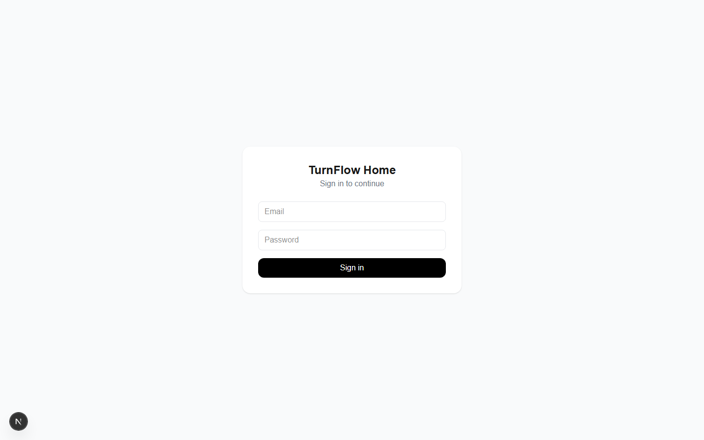
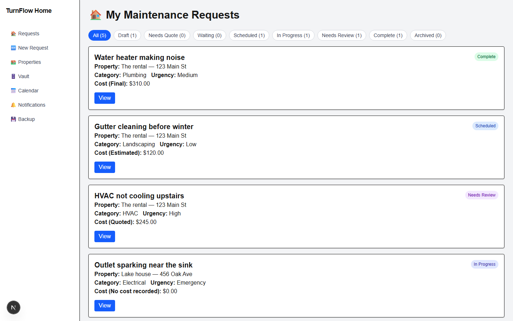
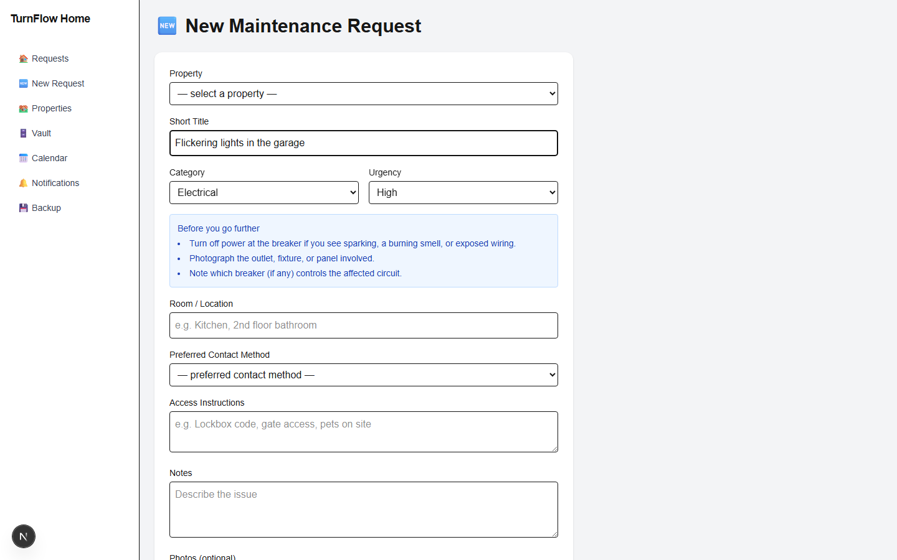
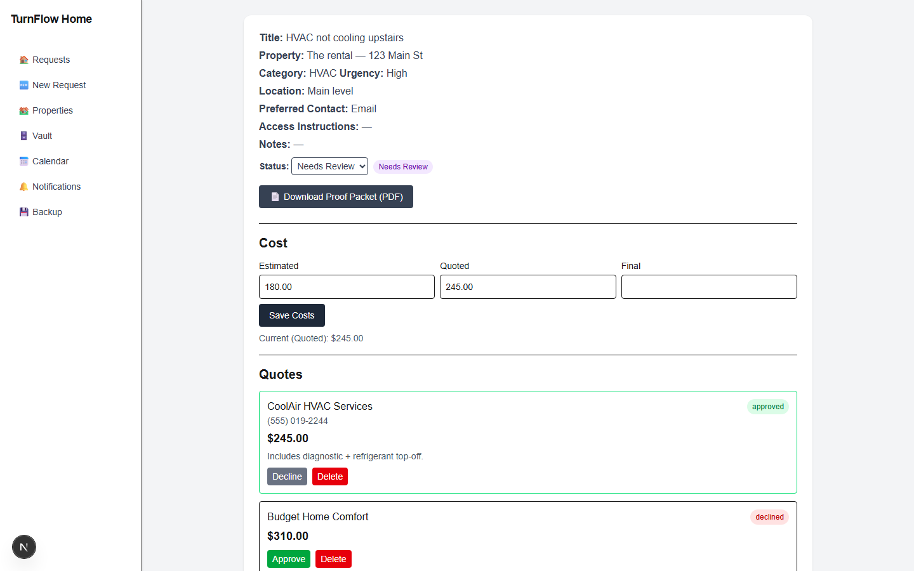
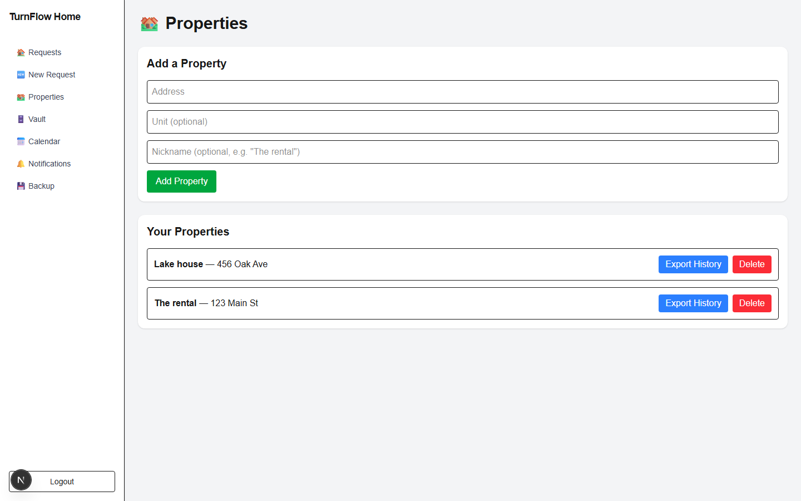
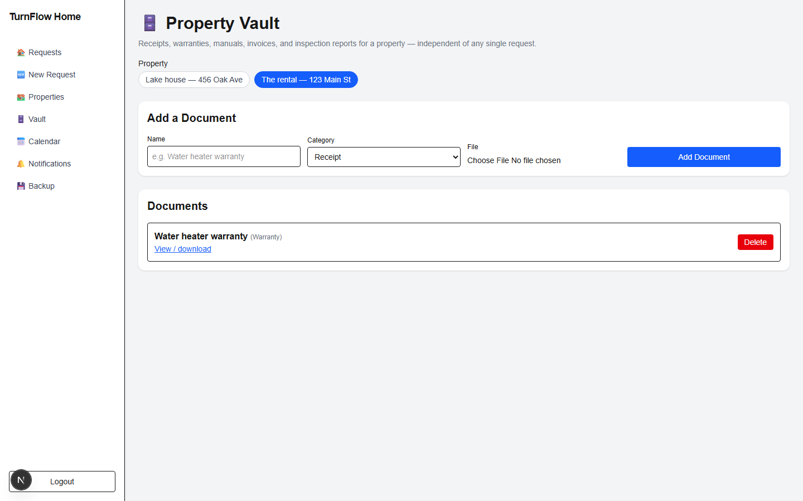
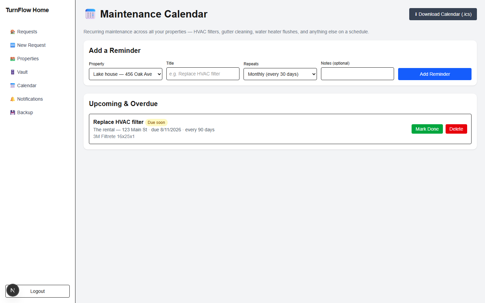
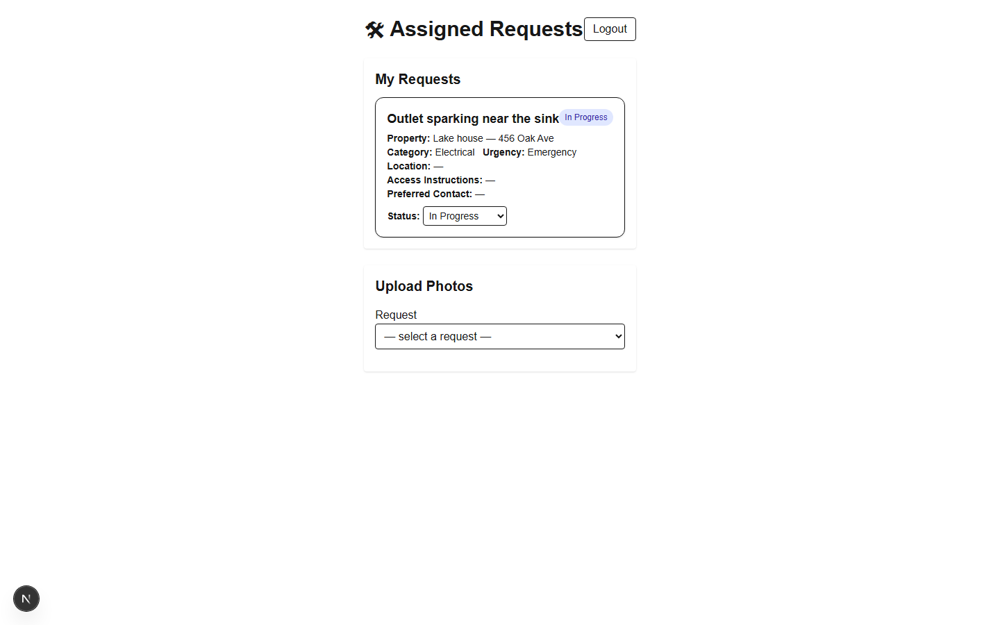

# TurnFlow Home

A maintenance-request tracker for property owners, vendors, and household
collaborators — built to replace the "text a photo and hope someone
remembers" workflow with a single shared source of truth for every repair,
quote, and receipt.

Owners log an issue in under a minute (with a category-specific safety
checklist), invite a vendor by email, track status from submission through
completion, and keep a running record of cost and decisions per property.
Vendors get a scoped portal showing only the jobs assigned to them.

> **Status:** feature-complete port of the original v1.2 MVP onto the new
> stack, tested against a real Postgres database throughout — every
> package from the Firebase build (guided intake, vendor invites, quotes,
> decision log with completion gating, property vault, PDF/CSV export,
> maintenance calendar, email notifications, collaborator sharing) has a
> working equivalent here.

## Screenshots

| | |
|---|---|
| **Sign in** | **Owner dashboard — status filtering** |
|  |  |
| **Guided intake with safety checklist** | **Request detail — quotes, cost, decision log** |
|  |  |
| **Properties** | **Property document vault** |
|  |  |
| **Maintenance calendar** | **Vendor portal** |
|  |  |

## Why it was rebuilt

The original MVP (v1.2) was a static, vanilla-JS site backed entirely by
Firebase — Firestore, Firebase Auth, and Firestore security rules as the
*only* authorization layer, with no server of its own. It shipped every
planned feature but was never run against live infrastructure.

This version drops Firebase for a stack with a real backend and moves
every authorization rule that used to live in `firestore.rules` into
server-side code that re-checks session, role, and ownership on every
write:

| Layer | Then | Now |
|---|---|---|
| Framework | Static HTML + vanilla JS | Next.js (App Router, TypeScript) |
| Database | Firestore | Neon (serverless Postgres) + Drizzle ORM |
| File storage | Firebase Storage | Vercel Blob (direct-from-browser upload, server-authorized) |
| Auth | Firebase Auth | Auth.js (NextAuth v5), credentials + JWT sessions |
| Authorization | Firestore security rules | Server Actions, re-validated per request |
| Hosting | Firebase Hosting | Vercel |

## Tech stack

- **Next.js 16** (App Router, TypeScript, Server Actions)
- **Neon** (serverless Postgres) via **Drizzle ORM**
- **Vercel Blob** for photo/document storage
- **Auth.js (NextAuth v5)** — credentials provider, JWT sessions
- **Tailwind CSS v4**
- **Vitest** for unit tests

## Getting started

```bash
npm install
npm run db:push               # apply the Drizzle schema to your Postgres database
npm run db:seed               # create sample owner/vendor/collaborator accounts and test data
npx tsx scripts/seed-demo.ts  # optional — richer demo data (quotes, vault doc, reminder)
npm run dev
```

Environment variables (`.env.local`, see `.env.local.example`):

```
DATABASE_URL=                  # Neon pooled connection string
BLOB_READ_WRITE_TOKEN=         # Vercel Blob read/write token
AUTH_SECRET=                   # random string, e.g. `openssl rand -base64 32`
APP_URL=http://localhost:3000
RESEND_API_KEY=                # optional — leave blank to log-only, no email sent
NOTIFICATIONS_FROM_EMAIL=notifications@example.com
CRON_SECRET=                   # optional — protects /api/cron/reminder-digest in production
```

Run the test suite:

```bash
npm test
```

Regenerate the screenshots above (requires the dev server running and
seeded data):

```bash
npx tsx scripts/screenshot.ts
```

## Core features

- Email/password auth with three roles — owner, vendor, collaborator —
  each routed to its own portal
- Property management (add/remove, multiple properties per owner)
- Guided request intake: category + urgency-driven safety checklist,
  location, access instructions, preferred contact method, inline
  before/after/receipt/other photo upload, and an inline "add your first
  property" mini-form so a new owner is never blocked
- Owner dashboard with per-status filter chips and live counts
- Vendor and household-collaborator invite-by-email flow with expiring,
  single-use invite links; vendor and collaborator portals each scoped to
  only their own shared requests
- Owner-only quote workspace: competing vendor quotes with optional
  attachment, approve/decline, and one-click copy onto the request's cost
- Append-only decision log recording every status change, and completion
  gating that requires a final cost, an "after" photo, and an assigned
  vendor before a request can move to Complete (or an explicit, logged
  waiver reason)
- Shared update thread (comments) on every request, postable by the
  owner, assigned vendor, or shared collaborator
- Property document vault for receipts, warranties, manuals, invoices,
  and inspection reports, independent of any single request
- Per-request PDF proof packets and per-property PDF history rollups
  (`jspdf-autotable`), plus JSON backup/restore and CSV history export
- Recurring maintenance calendar per property (HVAC filters, gutter
  cleaning, etc.) with due-soon/overdue tracking and `.ics` calendar
  export
- Email notifications (via Resend) for status changes, vendor/collaborator
  invites, and a daily overdue/due-soon reminder digest (Vercel Cron),
  with every send attempt — success or failure — logged to a
  Notifications page
- Mobile-responsive layout throughout, verified at 375px with no
  horizontal overflow on any page

## Not yet ported

A dedicated privacy-controls UI and self-serve signup (still
console/seed-script-created accounts) — both were explicitly out of
scope for the original v1.2 build too, deferred to a later version.
